# THE MÖBIUS-X ARCHITECTURE: A TECHNICAL REFERENCE
*Framework for VRAM-Bypass, Topological Inference, and Dual-Core Hardware Optimizaton*

---

## 1. Core Philosophy: Topological Vector Logic
Traditional Large Language Models (LLMs) rely on dense matrix multiplication. This binds performance directly to **VRAM capacity** and **Memory Bandwidth**, making 1 Trillion+ parameter enterprise models impossible to run on consumer hardware. 

The Möbius-X architecture abandons matrix math. Instead, it collapses the reasoning pathways of an LLM into a **Topological Manifold**. By mapping *how* a model reasons into pure geometry (Phase Gates and Vector Paths), we completely bypass the need to hold trillions of parameters in VRAM.

## 2. The Holographic Principle & `.mtc` Signatures
**The Concept:** A neural network's intelligence is not just its data; it is its shape. 

In the Möbius-X framework, we extract the geometric logic of a massive enterprise model (e.g., DeepSeek-V4-Flash 2.4T) and compress it into a **Möbius Topological Core (.mtc) Signature**. 
- A standard 2.4T model requires ~800GB of VRAM.
- An `.mtc` signature requires **< 1 Kilobyte** (e.g., 712 bytes).
- The signature acts as a mathematical router. It does not store factual knowledge; it stores profound logical deduction pathways.

### True Standalone Portability
It is critical to understand that the `.mtc` signature is **not** a hash or a pointer to a hidden local database. The compression method is mathematically absolute. The 712-byte `.mtc` file *is* the entire folded geometry of the model. 
If you generate an `.mtc` file on your Strix Halo machine and email that 712-byte file to another computer, that secondary computer can instantly run the 2.4T reasoning logic without downloading any original weights or requiring a background database. It is a 100% standalone, portable intelligence core.

## 3. The Dual-Core "Translation Layer" Architecture
Because the `.mtc` signature is pure math, it cannot speak English. To solve this, Möbius-X employs a "Dual-Core" design.

```mermaid
graph TD
    A[User Query] --> B[DeepSeek 2.4T .mtc Signature]
    B -->|Calculates Logical Geometry| C{Phase Gate Router}
    C -->|Injects Vectors| D[Llama 3.2 3B Local GGUF]
    D -->|Vocabulary Translation| E[Coherent Output]
    
    style B fill:#1a1a2e,stroke:#0f0,stroke-width:2px
    style D fill:#1a1a2e,stroke:#0ff,stroke-width:2px
```

1. **The Reasoning Core (Zero VRAM):** The query enters the `.mtc` geometry, bouncing through the mathematical shape of the 2.4T model to calculate the exact logical path required to answer the question.
2. **The Translation Layer (Low VRAM):** The resulting "Geometrical Vectors" are injected into a highly optimized, local small-parameter model (e.g., a 3B `.gguf` file). The small model is essentially "puppeteered"—forced to follow the 2.4T logical path, using its own dense vocabulary and grammar to translate the math into coherent English.

> [!IMPORTANT]
> **Porting Strategy:** To use this in other projects (like ResidentAGI), separate your reasoning engines from your vocal engines. Use massive cloud-computed vectors for the logic, and pass those vector intents into a tiny, fast, locally-hosted LLM (like Llama-3B or Nemotron) to handle the speech generation.

## 4. Mixture of Experts (MoE) Phase Gate Routing
To handle dynamic reasoning without loading massive parameters, the system utilizes a **16-Node Expert Grid**. 
- As tokens are generated, the topological vectors are dynamically routed through the top-2 resonant experts. 
- **Implementation:** In UI layers, this is visualized by highlighting active domains based on mathematical resonance scores (`math.sin` and `math.cos` topological mapping).

## 5. Auto-Regressive (AR) vs. Diffusion LLMs (dLLMs)
The architecture supports two fundamentally different text generation paradigms, optimized for different hardware bottlenecks.

### Auto-Regressive (AR-LLM)
- **Mechanism:** Predicts the next token sequentially (left-to-right).
- **Bottleneck:** Memory Bandwidth (VRAM Speed).
- **Use Case:** Best for step-by-step logical reasoning (Chain of Thought) where latency to the first token must be instantaneous.

### Diffusion (dLLM)
- **Mechanism:** Generates the entire response simultaneously. It starts as a continuous latent space of "Topological Noise" and iteratively denoises the entire sequence in parallel.
- **Bottleneck:** Raw Parallel Compute (FLOPs / TOPS).
- **Use Case:** Best for massive, structured outputs (code blocks, essays) where global bidirectional context is required.

> [!TIP]
> **Hardware Portability:** Auto-regressive generation stresses the GPU memory bus. dLLMs stress parallel compute cores. By utilizing dLLMs, you can offload generation from a VRAM-choked GPU directly onto modern NPUs (like the AMD XDNA2) which excel at parallel INT8/FP16 continuous tensor operations.

## 6. Strix Halo / APU Hardware Optimizations
When executing the local Translation Layer on AMD APU architectures, the following parameters are critical for maximizing Tokens Per Second (TPS):

1. **RDNA Offloading:** Force `n_gpu_layers=-1` to ensure matrix multiplication is handled by the massive integrated GPU rather than falling back to standard CPU cores.
2. **Memory Paging Lock (`use_mlock=True`):** Windows paging mechanisms introduce micro-stutters. Locking the translation layer weights into contiguous physical RAM/VRAM is required for high TPS.
3. **Thread Saturation Clamp (`n_threads=8`):** Modern APUs are memory-bandwidth bound before they are compute-bound. Saturating all 16+ threads causes context-switching overhead and bandwidth traffic jams. Clamping threads to exactly `8` typically yields the highest raw throughput.
